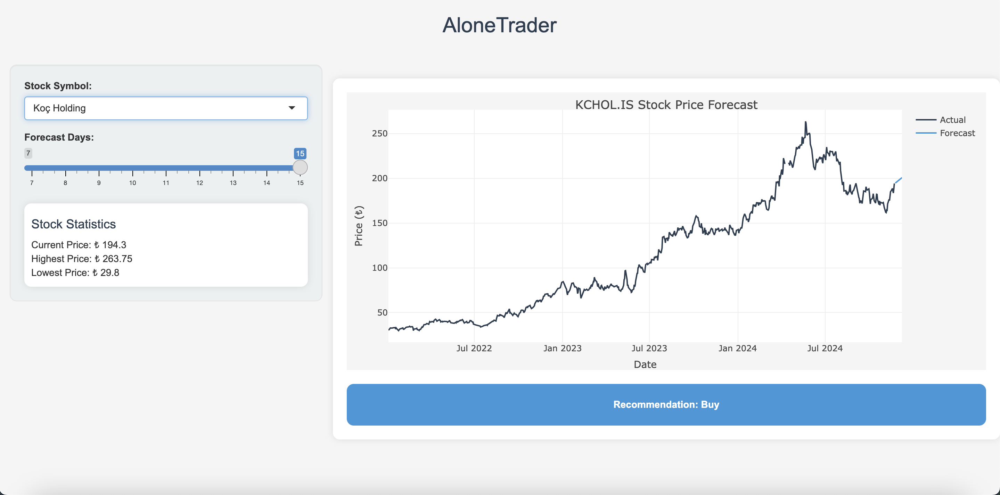

# AloneTrader: A Shiny App for Stock Price Forecasting

**AloneTrader** is an interactive web app built using R and the Shiny framework that helps individual investors forecast short-term stock prices for Turkish companies. It provides predictions and actionable recommendations (Buy, Hold, Sell) based on historical stock data.

## Features
- **Stock Forecasting**: Uses ARIMA (Auto-Regressive Integrated Moving Average) for short-term stock price predictions (7-15 days).
- **Interactive Visualizations**: Displays historical and forecasted stock prices using Plotly for an interactive experience.
- **Actionable Recommendations**: Provides Buy, Hold, or Sell recommendations based on forecasted price trends.

## Data Sources
The app uses stock data for the following Turkish companies:
- Garanti Bankası (GARAN.IS)
- Türk Hava Yolları (THYAO.IS)
- Koç Holding (KCHOL.IS)
- Türk Telekom (TTKOM.IS)
- Emlak Konut (EKGYO.IS)
- Vestel Elektronik (VESTL.IS)
- Ford Otosan (FROTO.IS)
- Turkcell (TCELL.IS)
- Anadolu Efes (AEFES.IS)
- Petkim (PETKM.IS)

Stock data is fetched dynamically using the `quantmod` R package, which pulls data from Yahoo Finance.

## Features of the App
1. **Stock Selection**: Choose from a list of stocks.
2. **Forecast Days**: Select a forecast period between 7 and 15 days.
3. **Stock Statistics**: View current, highest, lowest, and average prices, market capitalization, and trading volume.
4. **Interactive Plot**: View both historical prices and the forecasted prices overlaid on a dynamic plot.
5. **Recommendations**: Based on forecast trends, the app will suggest whether to Buy, Hold, or Sell a stock.

## Screenshots

### 1. Koç Holding Example
The user interface allows users to select stocks, such as Koç Holding, and adjust forecast parameters:

### 2. Vestel Elektronik Example
Another example showing the UI for Vestel Elektronik with forecasted and historical stock prices:

## Live App

You can try the app live at the following link:  
[**AloneTrader Live App**](https://memint.shinyapps.io/AloneTrader/)
